<div align="center">
  
</div>

<div align="center">
  
</div>

<p align="center">
  <a href="https://github.com/Octavio345?tab=repositories">
    
  </a>
  <a href="https://github.com/Octavio345?tab=followers">
    
  </a>
  <a href="https://www.instagram.com/octavio.augusto07/">
    
  </a>
  
</p>

---

## Perfil

<table>
  <tr>
    <td width="58%">
      <strong>Octavio Augusto</strong>. Curso <strong>Desenvolvimento de Sistemas</strong> na <strong>Etec Polivalente</strong>, com extensao na <strong>Fatec</strong>.
      <br /><br />
      Trabalho com <strong>desenvolvimento web</strong>, <strong>marketing digital</strong> e <strong>social media</strong>, criando projetos digitais com foco em clareza, execucao e resultado.
    </td>
    <td width="42%">
      <strong>Atualmente</strong>
      <br /><br />
      No TCC, atuo como <strong>Machine Learning Engineer</strong>, usando <strong>Python</strong>, <strong>visao computacional</strong>, <strong>backend</strong> e integracao de modelos. Tambem aplico IA com <strong>ChatGPT</strong>, <strong>Claude</strong> e <strong>Chat APIs</strong>.
    </td>
  </tr>
</table>

---

## Stack

<div align="center">
  
</div>

---

## Contribuicoes em movimento

<div align="center">
  
</div>

---

## Frentes de trabalho

```txt
Web Development      HTML, CSS, JavaScript, React, Bootstrap, Tailwind CSS
Backend              APIs, integracoes, regras de negocio e suporte a sistemas
Machine Learning     Python, modelos, inferencia e aplicacao em projetos reais
Computer Vision      Processamento e classificacao de imagens
IA Aplicada          ChatGPT, Claude, Chat APIs, automacao e prototipacao
Marketing Digital    Social Media, conteudo, posicionamento e conversao
```

<div align="center">
  
</div>
