<div align="center">
  
</div>

<div align="center">
  
</div>

<p align="center">
  <a href="https://github.com/Octavio345?tab=repositories">
    
  </a>
  <a href="https://github.com/Octavio345?tab=followers">
    
  </a>
  <a href="https://www.instagram.com/octavio.augusto07/">
    
  </a>
</p>

---

## Perfil

<table>
  <tr>
    <td width="50%">
      <h3>Quem sou</h3>
      <p>
        Sou <strong>Octavio Augusto</strong>, tambem conhecido como <strong>Pescador</strong>. Curso <strong>Desenvolvimento de Sistemas</strong> na <strong>Etec Polivalente</strong>, com extensao na <strong>Fatec</strong>.
      </p>
      <p>
        Trabalho com <strong>desenvolvimento web</strong>, <strong>marketing digital</strong> e <strong>social media</strong>, sempre buscando transformar ideias em projetos reais.
      </p>
    </td>
    <td width="50%">
      <h3>Atuacao atual</h3>
      <p>
        No TCC, atuo como <strong>Machine Learning Engineer</strong>, usando <strong>Python</strong>, <strong>visao computacional</strong>, <strong>backend</strong> e integracao de modelos.
      </p>
      <p>
        Tambem uso <strong>ChatGPT</strong>, <strong>Claude</strong> e <strong>Chat APIs</strong> em projetos com inteligencia artificial aplicada.
      </p>
    </td>
  </tr>
</table>

---

## Stack

<div align="center">
  
  
  
  
  
  
  
  
  
  
  
  
  
  
</div>

---

## Commit ocean

<div align="center">
  
</div>

---

## Areas que eu construo

<table>
  <tr>
    <td width="33%">
      <h3>Web Development</h3>
      <p>Interfaces responsivas, paginas modernas, componentes reutilizaveis e integracao com APIs.</p>
    </td>
    <td width="33%">
      <h3>Machine Learning</h3>
      <p>Python, modelos, inferencia, visao computacional e aplicacao real em projetos.</p>
    </td>
    <td width="33%">
      <h3>Marketing Digital</h3>
      <p>Social Media, conteudo, posicionamento, criativos e estrategias de conversao.</p>
    </td>
  </tr>
</table>

---

## Fluxo de trabalho

```txt
ideia -> pesquisa -> prototipo -> codigo -> teste -> melhoria -> entrega
```

<div align="center">
  
</div>
