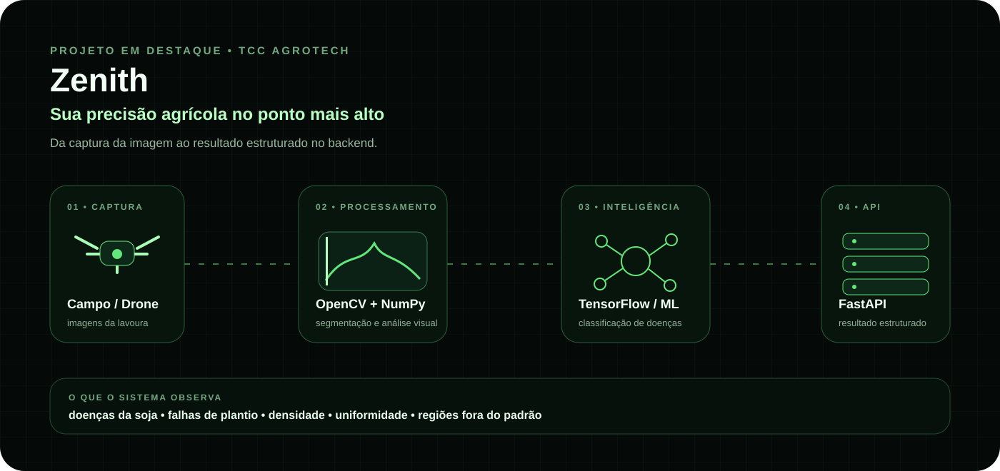

<div align="center">
  
</div>

<br/>

<div align="center">

### Software que encontra problemas reais. IA que ajuda a enxergar o campo de outro jeito.

**Desenvolvimento de Software · Inteligência Artificial · Visão Computacional · AgTech**

</div>

<p align="center">
  <a href="https://github.com/Octavio345?tab=repositories">
    
  </a>
  <a href="https://github.com/Octavio345?tab=followers">
    
  </a>
  <a href="https://www.instagram.com/octavio.augusto07/">
    
  </a>
</p>

---

## Sobre mim

Sou estudante de **Desenvolvimento de Sistemas na Etec Polivalente**, com extensão na **Fatec**, e gosto principalmente da parte em que tecnologia deixa de ser só código e começa a resolver um problema de verdade.

Hoje meu foco está em **backend, inteligência artificial, Machine Learning e visão computacional**. Meu TCC levou esse interesse para o campo: estamos desenvolvendo uma solução de **monitoramento agrícola voltada à soja**, conectando imagens de campo e drone a modelos de IA e processamento de imagens.

Esse projeto acabou definindo uma direção que quero continuar explorando: **AgTech e Agricultura Inteligente**, sem abandonar a base de desenvolvimento de software que torna essas soluções possíveis.

---

## Projeto em destaque · Zenith

<div align="center">
  
</div>

O projeto reúne **Machine Learning e visão computacional** para apoiar o monitoramento da lavoura. Entre os módulos desenvolvidos estão a **classificação de doenças da soja** e a análise visual da plantação para identificar padrões de vegetação, falhas de plantio, densidade e uniformidade.

No backend, utilizamos **Python + FastAPI** para receber e validar imagens, direcionar cada processamento ao módulo adequado e retornar os resultados de forma estruturada para a plataforma.

> **Stack do TCC:** Python · FastAPI · TensorFlow · OpenCV · NumPy · Pillow · Docker · Hugging Face Spaces

---

## Minha pilha

<div align="center">
  
</div>

---

## O que estou construindo agora

```text
01  IA & Machine Learning    → modelos aplicados a problemas reais
02  Visão Computacional     → análise, classificação e interpretação de imagens
03  Backend                 → APIs, processamento e integração entre serviços
04  Full Stack              → interfaces e aplicações completas
05  AgTech                  → software e inteligência aplicados ao campo
```

---

## Atividade no GitHub

<div align="center">
  
</div>

<div align="center">
  <sub>Construindo, testando e aprendendo — um commit de cada vez.</sub>
</div>

<br/>

<div align="center">
  
</div>
